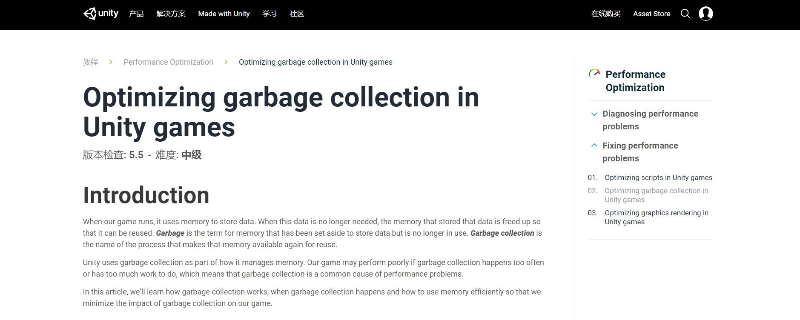

注：以下内容翻译、整理自AssetBundle官方教程 <https://unity3d.com/cn/learn/tutorials/topics/performance-optimization/optimizing-garbage-collection-unity-games>



​                                                


# Introduction

在游戏运行过程中，毫无疑问是使**用内存来存储数据**。

当某些数据不再使用时，用来存储这些数据的内存将会被释放出来，以便下次复用。

- 这些被释放出来的内存，被称为**垃圾**（**Garbage** ）

- 把这些释放出来的内存重新处理以便下次复用，这个过程被称为**垃圾回收**（**Garbage collection**，简称GC）

Unity自带GC机制来管理内存。

但是，如果GC频率过高或者每一次GC工作量太大，那么，游戏的性能将会大打折扣。

# Diagnosing problems with garbage collection

由于GC造成的性能表现包括：

- 帧率低
- 画面颠簸卡顿
- 偶发卡死

当然，其他问题也有可能造成上述表现。

但是，如果游戏出现了上述表现，首先应该考虑 通过Unity的Profile 来排查是否是GC造成的。

# A brief introduction to memory management in Unity

为了更好地理解GC和何时GC，首先来了解Unity是如何管理内存的。

Unity有两种不同的内存管理方式，分别用来运行 引擎自身的代码和开发者写的代码。

- 运行引擎自身的代码，内存管理方式为 manual memory management，不会产生GC
- 运行开发者写的代码，内存管理方式为 automatic memory management，会产生GC

简单来说，Unity的GC 大致如下：

- Unity有两部分内存来保存数据：**栈**和**堆**

  （栈用来保存短期的、小块的数据；堆用来保存长期的、大块的数据）

- 当一个变量创建之后，Unity会在栈或堆上 分配一块内存用来存储这个变量

- 只要这个变量还在作用范围内，对应的内存就会一直保留。

  我们把这样的内存称为 **被分配** （**allocated**），把存在栈上的变量称为 **栈对象**（**object on the stack**），把存在堆上的变量称为 **堆对象**（ **object on the heap**）。

- 当变量离开作用范围后，对应的内存则不再使用。

  我们把这样的内存称为 **被释放**（**deallocated**）

  栈对象 离开作用范围后，栈上的内存会立刻被释放；而堆对象 离开作用范围后，堆上的内存不会立刻被释放

- GC 便是为了释放不再使用的堆内存

### What happens during stack allocation and deallocation?

栈内存的分配和释放，非常快速简单。

这就是为什么栈可以用来存储短期的、小块的数据。因为，栈内存的分配和释放总是处于可预知的顺序和可预知的大小。

栈内存的工作方式跟数据结构的栈差不多：就是元素按照严格的顺序进栈出栈。

因为简单和有严格的顺序，所以快。

### What happens during a heap allocation?

堆内存的分配和释放，是非常复杂的。

这就是为什么堆可以用来存储长期的、大块的数据。因为，堆内存的分配和释放总是处于不可预知的顺序，而且每次申请内存空间的大小也是不确定的。

当一个堆对象创建时，会进行如下步骤：

- 首先，Unity会检查堆上是否还有足够的内存空间；如果有，则为堆对象分配内存
- 如果堆上没有足够的内存空间，Unity启动GC而释放未被使用的堆内存（这是一个缓慢的操作）；GC之后，如果有足够的内存空间，则为堆对象分配内存
- 如果GC之后仍然没有足够的内存空间，Unity会拓展堆内存（这是一个缓慢的操作），再重新为堆对象分配内存

所以，堆内存的分配就是缓慢的过程，特别是需要GC操作和拓展堆内存操作的时候。

### What happens during garbage collection?

每一次GC，都会进行如下步骤：

- 检查堆上的每一个对象
- 扫描该对象的所有引用，检查该对象是否仍在作用范围内
- 对于在作用范围内不再使用的对象，做好标记以待删除
- 删除所有被标记的对象且释放对应的内存

GC是一个非常昂贵的操作。

堆上的对象越多，代码中的引用越多，每一次GC所需要做的事情也就越多。

### When does garbage collection happen?

三种情况：

- 申请堆内存时，没有足够的空间
- 每个平台自定义的定期GC
- 手动写代码，强行执行GC

# Problems with garbage collection

带来的问题如下：

- 如果一次GC的工作量很大，会导致游戏卡顿
- 如果正在一些关键帧上GC，可能会导致掉帧
- **堆碎片**（ **heap fragmentation**）问题，堆碎片问题最后会导致 内存比预期用得多、GC也比预期要频繁

### Finding heap allocations

- 值类型 在栈上分配内存
- 引用类型 在堆上分配内存

# Reducing the impact of garbage collection

广泛地说，减少GC产生的影响大概有三种方法：

- 减少单次GC的工作量，工作量少了，一次GC的时间也短了
- 减少GC的频率
- 在非核心帧（比如Loading界面）上GC

### Reducing the amount of garbage created

#### 采用缓存

比如

```c#
void OnTriggerEnter(Collider other)
{
    Renderer[] allRenderers = FindObjectsOfType<Renderer>();
    ExampleFunction(allRenderers);
}
```

改成

```c#
private Renderer[] allRenderers;

void Start()
{
    allRenderers = FindObjectsOfType<Renderer>();
}


void OnTriggerEnter(Collider other)
{
    ExampleFunction(allRenderers);
}
```

#### 不要在高频调用的函数里进行堆内存分配

比如，Unity中的 `Update()`  和 `LateUpdate()`, 它们会在每一帧里调用一次。

可以考虑在 `Start()` 和 `Awake()` 中进行缓存，并且在必要的时候执行方法，比如：

- 当变量发生改变的时候，执行方法
- 设置一个计时器定时执行，而不是每一帧都执行

比如：

```c#
void Update()
{
    ExampleGarbageGeneratingFunction(transform.position.x);
}
```

可以改成 

```c#
private float previousTransformPositionX;

void Update()
{
    float transformPositionX = transform.position.x;
    if (transformPositionX != previousTransformPositionX)
    {
        ExampleGarbageGeneratingFunction(transformPositionX);
        previousTransformPositionX = transformPositionX;
    }
}
```

也可以改成

```c#
private float timeSinceLastCalled;
private float delay = 1f;
void Update()
{
    timeSinceLastCalled += Time.deltaTime;
    if (timeSinceLastCalled > delay)
    {
        ExampleGarbageGeneratingFunction();
        timeSinceLastCalled = 0f;
    }
}
```

这样的改动虽然很小，但是会产生不错的优化效果。

#### 对容器进行 Clear() 操作

创建新的容器会在堆内存上进行分配内存，所以，应该使用Clear() 操作而不是 new 一个新的容器

如下：

```c#
void Update()
{
    List myList = new List();
    PopulateList(myList);
}
```

改成

```c#
private List myList = new List();
void Update()
{
    myList.Clear();
    PopulateList(myList);
}
```

#### 采用对象池

对象池用来复用一些对象，特别是需要频繁创建和销毁的对象，比如，枪打出来的子弹。

所以，对象池在游戏中用途很广。

### Common causes of unnecessary heap allocations

#### 字符串

在C#中，字符串是引用类型而不是值类型，这就意味着创建和销毁字符串是会产生垃圾的。

最重要的是，string是不可改变的（**immutable**），所以，每一次操作字符串（比如拼接等）其实都是在创建新的字符串和销毁老的字符串，于是，会产生垃圾。

所以：

- 减少不必要的字符串创建操作；如果使用同样的值字符串，应该创建一次且保存下来

- 减少不必要的字符串操作；比如，有一个需要频繁更新的Text用来显示时间，该字符串是由两个字符串拼接而成的，那么，可以考虑拆分成两个Text

  如下：

  ```c#
  public Text timerText;
  private float timer;
  
  void Update()
  {
      timer += Time.deltaTime;
      timerText.text = "TIME:" + timer.ToString();
  }
  ```

  应该改成

  ```c#
  public Text timerHeaderText;
  public Text timerValueText;
  private float timer;
  
  void Start()
  {
      timerHeaderText.text = "TIME:";
  }
  
  void Update()
  {
      timerValueText.text = timer.toString();
  }
  ```

- 尽量使用 StringBuilder 类

- 移除不必要的 `Debug.Log()`

#### 函数调用

首先，需要意识到：每一次调用函数，都是在产生垃圾。

但是，每一个写出来的函数或多或少都有用处，所以都是必须调用的。

所以，可以考虑：

- 把函数的返回值存起来
- 减少函数的调用频率
- 重构函数代码

比如：

```c#
void ExampleFunction()
{
    for (int i = 0; i < myMesh.normals.Length; i++)
    {
        Vector3 normal = myMesh.normals[i];
    }
}
```

每一次循环都会产生一个数组作为返回值，因此，可以改为：

```c#
void ExampleFunction()
{
    Vector3[] meshNormals = myMesh.normals;
    for (int i = 0; i < meshNormals.Length; i++)
    {
        Vector3 normal = meshNormals[i];
    }
}
```

再比如， `GameObject.name`  和  `GameObject.tag` 都会返回一个字符串产生垃圾，那么在某些特殊情况下，可以考虑使用 `GameObject.CompareTag()`.

```c#
private string playerTag = "Player";

void OnTriggerEnter(Collider other)
{
    bool isPlayer = other.gameObject.tag == playerTag;
}
```

每一次调用都会产生一个字符串作为返回值，因此，可以改为：

```c#
private string playerTag = "Player";

void OnTriggerEnter(Collider other)
{
    bool isPlayer = other.gameObject.CompareTag(playerTag);
}
```

在Unity中， `GameObject.CompareTag()` 不是个例，同理，可以使用 `Input.GetTouch()`  和 `Input.touchCount` 来替代 `Input.touches`， 使用 `Physics.SphereCastNonAlloc()` 来替代 `Physics.SphereCastAll()`

#### 装箱

装箱通常发生在 把值类型转化成引用类型的时候。

比如，`String.Format()` 就会发生装箱操作

```c#
void ExampleFunction()
{
    int cost = 5;
    string displayString = String.Format("Price: {0} gold", cost);
}
```

装箱会产生垃圾，是因为每一个值类型被装箱后都会产生一个 `System.Object`  的引用类型，从而在堆上分配空间。

#### 协程

使用 `StartCoroutine()` 会产生小部分的垃圾，因为Unity会产生一个管理协程的实例。

所以，使用协程时需要小心，特别是包含延迟调用 `StartCoroutine()` 的嵌套协程

比如

```c#
yield return 0;
```

整型0会被装箱，所以应该改为

```c#
yield return null;
```

再比如

```c#
while (!isComplete)
{
    yield return new WaitForSeconds(1f);
}
```

改为

```c#
WaitForSeconds delay = new WaitForSeconds(1f);

while (!isComplete)
{
    yield return delay;
}
```

如果整个工程因为协程而产生大量的GC，那么，应该考虑重构代码，使用其他技术方案来替代协程。

#### foreach循环

```c#
void ExampleFunction(List listOfInts)
{
    foreach (int currentInt in listOfInts)
    {
            DoSomething(currentInt);
    }
}
```

在Unity5.5或者更早版本，使用foreach循环时 每一次都会产生垃圾。

如果Unity不能升级，那么可以考虑 for循环或者while循环。

当然，这个问题已经在Unity5.5修复了

#### 函数引用

函数引用，不管是匿名函数还是实名函数，都是引用类型。

所以，会造成堆内存分配。

因此，应该尽可能地减少函数引用的使用。

#### LINQ 与 正则表达式

LINQ和正则表达式，会因为装箱而产生垃圾。

如果对性能非常在意的话，要尽量避免二者结合同时使用。

## Structuring our code to minimize the impact of garbage collection

结构体是值类型，但是如果其中包含引用类型，那么GC在扫描时依然会扫描所有的结构体实例。

比如

```c#
public struct ItemData
{
    public string name;
    public int cost;
    public Vector3 position;
}
private ItemData[] itemData;
```

如果改成这样之后

```c#
private string[] itemNames;
private int[] itemCosts;
private Vector3[] itemPositions;
```

GC在扫描时，就只会扫描string数组。

再比如

```c#
public class DialogData
{
    private DialogData nextDialog;

    public DialogData GetNextDialog()
    {
        return nextDialog;
    }
}
```

如果改成这样之后

```c#
public class DialogData
{
    private int nextDialogID;

    public int GetNextDialogID()
    {
        return nextDialogID;
    }
}
```

会减少类之间的引用。

## Timing garbage collection

在合适的时候（比如，Loading界面），强行调用GC

```c#
System.GC.Collect();
```

