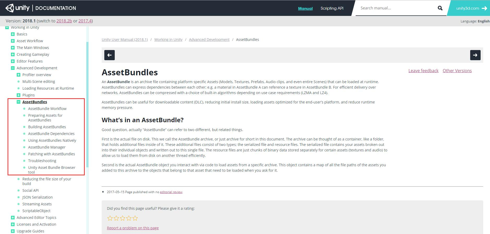
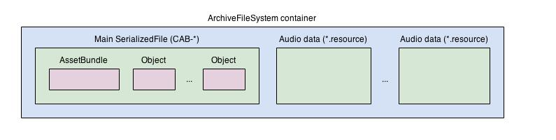

# Unity-AssetBundles
以下内容翻译、学习自AssetBundle官方文档 https://docs.unity3d.com/Manual/AssetBundlesIntro.html




# AssetBundles

**AssetBundle** 是一个档案文件（archive file）

- 包括特定平台下的资源，比例，模型、纹理、Prefab、音频甚至整个Scene，
- 该文件可以在游戏运行期间加载入游戏。

AssetBundle 中保存了资源之间的依赖关系（dependencies）

- 例如，AssetBundle A 中的材质引用了AssetBundle B 中的纹理。

为了保证网络传输效率，AssetBundles 会根据需要自行选择压缩算法

- LZMA
- LZ4

所以，AssetBundle 用作可下载内容（downloadable content ，简称DLC）

- 减少用户初始安装的大小
- 减少游戏运行时的内存压力

### 什么是AssetBundle?

这个名词，有两个层面的概念：

- AssetBundle资源包

  - 就是一个具体的文件，里面包含了许多附加文件（additional files）
  - 附加文件，一般两种类型：序列化文件（the serialized file）和资源文件（resource files）

- 代码中 AssetBundle 对象

  ```c#
  AssetBundle myLoadedAssetBundle = AssetBundle.LoadFromFile()
  ```


# AssetBundle Workflow

### 第一步：将资源标记为AssetBundles

1. 在Project面板中，选好所有待打包的资源
2. 在Inspector面板底部，左部的下拉菜单设置 AssetBundle名， 右部的下拉菜单设置变量名
3. 在左边的下拉菜单中点击 `new` ，并输入对应的 AssetBundle名。注意，AssetBundle名支持文件夹命名方式，即以`/` 分隔开，例如，`environment/forest`
4. 在设置AssetBundle之后，可以继续在右边的下拉菜单中设置变量名。当然，**变量名不是必需的**。

注：更多打包策略，详见【Preparing Assets for AssetBundles】

### 第二步：创建AssetBundles

在Assets文件夹下，建立一个文件夹，命名为`Editor`。将以下脚本放入Editor文件夹中。

```c#
using System.IO;
using UnityEditor;

public class CreateAssetBundles
{

    [MenuItem("Assets/Build AssetBundles")]
    static void BuildAllAssetBundles()
    {
        string assetBundleDirectory = "Assets/AssetBundles";
        if (!Directory.Exists(assetBundleDirectory))
        {
            Directory.CreateDirectory(assetBundleDirectory);
        }

        BuildPipeline.BuildAssetBundles(assetBundleDirectory, BuildAssetBundleOptions.None, BuildTarget.StandaloneWindows);
    }
}
```

在面板Asset菜单中，创建一个名为“Assets/Build AssetBundles”的菜单项，点击运行。

打成的AssetBundle资源包，根据代码放在 `assetBundleDirectory` 路径下。

注：更多关于代码操作，详见【Building AssetBundles】

### 第三步：上传AssetBundle至非本地存储

注意，每一步都不是一成不变的。

如果需要把AssetBundle上传至非本地存储，那么，可以使用第三方工具将AssetBundle上传

- AssetBundle资源包中，包括两个文件

如果仅仅需要将AssetBundle放至本地，那么，直接跳过此步，进入下一步。

### 第四步：读取AssetBundle中的资源

如果采取的是**本地保存**，那么，请使用`AssetBundles.LoadFromFile `， 如下：

```c#
AssetBundle myLoadedAssetBundle = AssetBundle.LoadFromFile(Application.dataPath + "/AssetBundles/" + "myab");
if (myLoadedAssetBundle == null)
{
    Debug.Log("Failed to load AssetBundle!");
    return;
}
GameObject prefab = myLoadedAssetBundle.LoadAsset<GameObject>("TestObject");
GameObject go = Instantiate(prefab) as GameObject;
```

注意：

- **AssetBundle.LoadFromFile(string path)** 
  - **path**：资源包的路径
- **myLoadedAssetBundle.LoadAsset\<T\>(string name)**
  - **T**：泛型，上述例子为GameObject
  - **name**：资源的名字，上述例子为prefab的名字，叫“TestObject”


如果你采取的是**非本地保存**，那么，请使用`UnityWebRequest.GetAssetBundle `， 如下

```c#
IEnumerator InstantiateObject()
{
    string uri = "file:///" + Application.dataPath + "/AssetBundles/" + assetBundleName;        
    UnityWebRequest request = UnityWebRequest.GetAssetBundle(uri, 0);
    yield return request.Send();
    
    AssetBundle bundle = DownloadHandlerAssetBundle.GetContent(request);
    GameObject cube = bundle.LoadAsset<GameObject>("Cube");
    GameObject sprite = bundle.LoadAsset<GameObject>("Sprite");
    Instantiate(cube);
    Instantiate(sprite);
}
```

注意：

- **GetAssetBundle(string url, int version)**
  - **url**：下载地址
  - **version**：资源包的版本

在上述例子中，url仍可以指向本地文件，也可以指向任何下载地址。

然后通过`DownloadHandlerAssetBundle.GetContent()` 获取到 AssetBundle对象。


总之，无论采取什么方式，最终都获取到一个AssetBundle对象。

然后再通过`LoadAsset<T>(string name) `， 即可通过类型 `T` 和名字 `name` 获取到资源包内的任何资源对象。

最后，便可以像使用其他对象一样来使用这些从AssetBundle获取的对象

例如，在场景中创建一个GameObject，只需要调用`Instantiate(cube)` 即可。 

注：更多关于读取AssetBundle中的资源问题，详见【Using AssetBundles Natively】


# Preparing Assets for AssetBundles

虽然在使用AssetBundles时，完全可以将任何资源打入任何AssetBundles包内，但也可以参考以下打包策略。

### 按功能逻辑分组

把同一功能模块的资源打入同一AssetBundles包，比如，UI、角色、环境和一些全程频繁出现的对象

**例子**

- 纹理 + 布局数据，用于UI
- 模型 + 动画，用于角色
- 公用纹理 + 模型，用于多场景共享

**对于DLC而言，优先考虑按功能逻辑分组**

- 将不同功能模块的资源彼此分开
- 可以对其中某一功能模块的资源进行修改
- 不需要重新下载未修改的功能模块

### 按类型分组

将同一类型的资源打入同一AssetBundles包内，比如，音频文件或者语言本地化文件

**将AssetBundles包用于跨平台，优先考虑按类型分组**

- 比如，如果某工程在windows和mac上，对于音频的压缩方式是相同的，那么，完全可以将所有音频分配到一个AssetBundles包内。
- 在与多版本兼容方面也更具优势

### 按并发内容分组

把需要同时使用的资源打入同一AssetBundles包内，比如，模型、纹理、音频等。

**如果是一个基于级别类的游戏，优先考虑按并发内容分组**

- 某一个级别，可能需要同时使用一组资源
- 尽量确保“依赖关系”不要跨包，否则会根据依赖关系去加载其他包

按并发内容分组，最常用于：将整个Scene打入一个包内。


无论按照什么方式分组，都应该遵从如下：

- 将频繁修改的和非频繁修改的分开
- 需要同时加载的资源才打入一个包内，比如，一个模型和该模型包括的纹理和动画
- 如果多个包内的多个资源都依赖于一个其他包的某资源，可以将这些依赖关系涉及到的资源重新打新包
- 不可能同时加载的资源，分别打入到各自的包内
- 如果一个包内的50%以下的资源被频繁调用，考虑拆分
- 必要时，考虑合并包资源
- 如果有些资源存在不同的版本，可以考虑使用AssetBundle的变量名（AssetBundle Variants）


# Building AssetBundles

在【AssetBundle Workflow】中简单介绍了

```
BuildPipeline.BuildAssetBundles()
```

- **第一个参数："Assets/AssetBundles"**

  文件导出的路径

  在使用前，请保证此路径存在

- **第二个参数：BuildAssetBundleOptions**

  这是一个枚举，着重介绍以下三种：

  - BuildAssetBundleOptions.None
    - 采用 LZMA 压缩算法
    - LZMA算法要求全部解压完成后，才能访问其中部分资源
    - 压缩后的文件比较小，但解压时间相对长一些
    - 一旦解压后，又会被 LZ4 重新压缩
    - LZ4 可以不要求全解压才能访问其中部分资源
    - 如果是打包整个角色或者Scene，可以考虑传此参数
  - BuildAssetBundleOptions.UncompressedAssetBundle
    - 解压后文件较大，但读取快
  - BuildAssetBundleOptions.ChunkBasedCompression
    - 采用 LZ4 压缩算法
    - LZ4 基于块的压缩算法，允许解压部分

- **第三个参数：BuildTarget**

  目标平台，可以传入，也可以使用  `EditorUserBuildSettings.activeBuildTarget` 获取设置的平台信息


N个资源打包后，会出现 2*(N+1) 个文件，会预想中多出来两个文件

- 多出来的文件，用来显示多个AssetBundles之间的依赖关系


每个包对应的两个文件是：

- AssetBundle文件
- AssetBundle文件 + “.manifest”

#### AssetBundle文件

该文件大致结构如下图所示



- 一般的AssetBundle文件 和 打包Scene的AssetBundle文件 有些许不同

#### Manifest文件

- 资源
- 依赖关系
- 循环校验码等其他信息

注：更多AssetBundle文件和Manifest文件信息，详见【Using AssetBundles Natively】


# AssetBundle Dependencies

AssetBundles 依赖关系的发生是因为：

- 一个AssetBundles中的资源引用了其他AssetBundles里面的资源

如果多个不同的 AssetBundles包 依赖于其他包内的同一个资源，那么，被依赖的资源会被复制多份到若干个不同的AssetBundles包内

**例子**

 **Bundle 1** 中的材质引用了 **Bundle 2** 中的纹理

- 在代码上，先Load Bundle1 还是先Load Bundle2 不重要
- 重要的是，在使用Bundle1 中的该材质时，请保证 Bundle2 已经被加载过


# Using AssetBundles Natively

### 加载AssetBundles

- AssetBundle.LoadFromMemoryAsync
- AssetBundle.LoadFromFile
- WWW. LoadfromCacheOrDownload *（被弃用）*
- UnityWebRequest 的 DownloadHandlerAssetBundle *（Unity 5.3 or newer）*

不同的平台、不同的压缩方式，各种表现不同

#### AssetBundle.LoadFromMemoryAsync

```c#
AssetBundle.LoadFromMemoryAsync(byte[] binary)
```

参数是：字节数组

```c#
using UnityEngine;
using System.Collections;
using System.IO;

public class Example : MonoBehaviour
{
    IEnumerator LoadFromMemoryAsync(string path)
    {
        AssetBundleCreateRequest createRequest = AssetBundle.LoadFromMemoryAsync(File.ReadAllBytes(path));
        yield return createRequest;
        AssetBundle bundle = createRequest.assetBundle;
        var prefab = bundle.LoadAsset<GameObject>("MyObject");
        Instantiate(prefab);
    }
}
```

- 如果是LZMA压缩，先解压再加载
- 如果是LZ4压缩，直接通过压缩状态加载

#### AssetBundle.LoadFromFile

```c#
public class LoadFromFileExample extends MonoBehaviour 
{
    function Start() {
        var myLoadedAssetBundle = AssetBundle.LoadFromFile(Path.Combine(Application.streamingAssetsPath, "myassetBundle"));
        if (myLoadedAssetBundle == null) {
            Debug.Log("Failed to load AssetBundle!");
            return;
        }
        var prefab = myLoadedAssetBundle.LoadAsset.<GameObject>("MyObject");
        Instantiate(prefab);
    }
}
```

- 读取解压包时，该方法较高效
- 注意：上述脚本中使用的 `Application.streamingAssetsPath` ，会根据Unity版本和平台不同而不同

#### UnityWebRequest

- 先用 `UnityWebRequest.GetAssetBundle()`  获得一个request对象
- 再从 `DownloadHandlerAssetBundle.GetContent() `， 获取request中的AssetBundle对象

```c#
IEnumerator InstantiateObject()
{
        string uri = "file:///" + Application.dataPath + "/AssetBundles/" + assetBundleName;        UnityEngine.Networking.UnityWebRequest request = UnityEngine.Networking.UnityWebRequest.GetAssetBundle(uri, 0);
        yield return request.Send();
    
        AssetBundle bundle = DownloadHandlerAssetBundle.GetContent(request);
        GameObject cube = bundle.LoadAsset<GameObject>("Cube");
        GameObject sprite = bundle.LoadAsset<GameObject>("Sprite");
        Instantiate(cube);
        Instantiate(sprite);
    }
```

- 处理更灵活
- 可以减少不必要的内存使用

### 从AssetBundles加载资源

- LoadAsset

  ```c#
  GameObject gameObject = loadedAssetBundle.LoadAsset<GameObject>(assetName);
  ```

- LoadAllAssets

  ```c#
  Object[] objectArray = loadedAssetBundle.LoadAllAssets();
  ```

- LoadAssetAsync

  ```c#
  AssetBundleRequest request = loadedAssetBundleObject.LoadAssetAsync<GameObject>(assetName);
  yield return request;
  var loadedAsset = request.asset;
  ```

- LoadAllAssetsAsync

  ```c#
  AssetBundleRequest request = loadedAssetBundle.LoadAllAssetsAsync();
  yield return request;
  var loadedAssets = request.allAssets;
  ```

### 加载Manifest文件

多用于读取其中的AssetBundles 依赖关系

```c#
AssetBundle assetBundle = AssetBundle.LoadFromFile(manifestFilePath);
AssetBundleManifest manifest = assetBundle.LoadAsset<AssetBundleManifest("AssetBundleManifest");

//Pass the name of the bundle you want the dependencies for.
string[] dependencies = manifest.GetAllDependencies("assetBundle"); 
foreach(string dependency in dependencies)
{
    AssetBundle.LoadFromFile(Path.Combine(assetBundlePath, dependency));
}
```

### 处理已加载的AssetBundles

Unity不会自动卸载AssetBundle。

资源清理会在特定时间触发，也可以手动触发。

```c#
AssetBundle.Unload(bool flag)
```

- 参数：是否卸载从此AssetBundle实例化的所有对象

大多数情况下，选择 `AssetBundle.Unload(true)` ，通常如下情况：

- 明确知道要卸载所有资源，比如，过关
- 明确知道只需要一个资源，可以先把其他的都卸载了，再只加载这一个


# AssetBundle Manager

AssetBundle Manager 是一个工具。（本人注：目前该工具在Asset Store 已下架）

### Simulation Mode

模拟模式，把所需的资源打一个假包，其实根据包内的数据访问的还是本地资源，仅模拟使用

- 优点：便于修改
- AssetBundle 的变量（Variants）在此模式下，不起作用

### Local AssetBundle Server

根目录中创建一个名为AssetBundles的文件夹，与Assets文件夹的级别相同

#### AssetBundleManager.Initialize()

```c#
IEnumerator Start()
{
    yield return StartCoroutine(Initialize());
}

IEnumerator Initialize()
{
    var request = AssetBundleManager.Initialize();
	if (request != null)
    	yield return StartCoroutine(request);
}
```

#### AssetBundleManager.LoadAssetAsync()

```c#
IEnumerator InstantiateGameObjectAsync(string assetBundleName, string assetName)
{
    // Load asset from assetBundle.
    AssetBundleLoadAssetOperation request = AssetBundleManager.LoadAssetAsync(assetBundleName, assetName, typeof(GameObject));
    
    if (request == null)
        yield break;
        
    yield return StartCoroutine(request);
    
    // Get the asset.
    GameObject prefab = request.GetAsset<GameObject>();
    if (prefab != null)
        GameObject.Instantiate(prefab);
}
```

#### AssetBundleManager.LoadLevelAsync()

```c#
IEnumerator InitializeLevelAsync(string levelName, bool isAdditive)
{
    // Load level from assetBundle.
    AssetBundleLoadOperation request = AssetBundleManager.LoadLevelAsync(sceneAssetBundle, levelName, isAdditive);
    if (request == null)
        yield break;
    yield return StartCoroutine(request);
}
```

#### AssetBundleManager.ActiveVariants

这个属性的类型是 `string[]`, 通过代码赋值即可


# Patching with AssetBundles

更新AssetBundles资源包，简单来说就是：**用 `UnityWebRequest` 下一个新的，然后把老的资源包替换掉。**

所以，问题在于：如何区分新老二者的改动？

Unity本身不提供这种查看改动的功能，所以，可以选择

- JSON文件保存资源包信息
- 使用MD5算法校验

或者其他自定义的、需要自己写代码实现的办法


# Troubleshooting

介绍几个常见的问题：

### 资源重复

当位于两个不同的AssetBundles资源包里的两个资源，都引用了额外的共享资源，那么，这个共享资源会被赋值多份

- 可以将这两个不同的AssetBundles资源包合并成一个
- 也可以将这两个不同的AssetBundles资源包继续划分，以保证在同一时间不会加载两个共享依赖关系的资源包

所以，最根本的是：确保不会共享依赖关系；

但这样会增加复杂度。

可以使用 `AssetDatabase  ` 和 `AssetImporter  ` 二者来编写脚本，可以用此脚本来检测整个工程是否资源重复。

而且，也强烈推荐编写相关脚本。

### Sprite图集重复

美术资源的图集，可能是Unity自动打的，比如使用UGUI，也可能是使用工具手动打的

可以考虑尽量把同一个图集的美术资源也打入同一个AssetBundles资源包

### Android纹理

在Android平台，往往需要采取不同的压缩方式

而不同的压缩方式往往会影响打包分组的方式，比如，可以考虑将无法用ETC1压缩的应该单独打成一个包

### iOS超量使用

对于拥有成百上千的AssetBundles资源包的工程，往往会加载AssetBundles资源包失败而报错

Unity 5.3.2p2 之后版本已经修复


